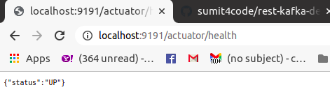
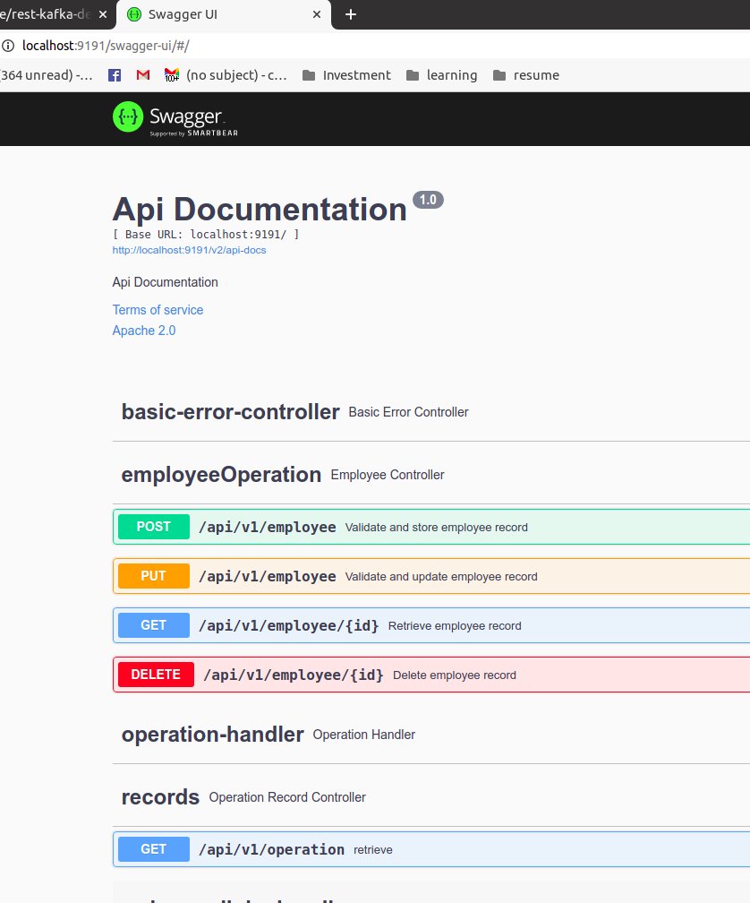
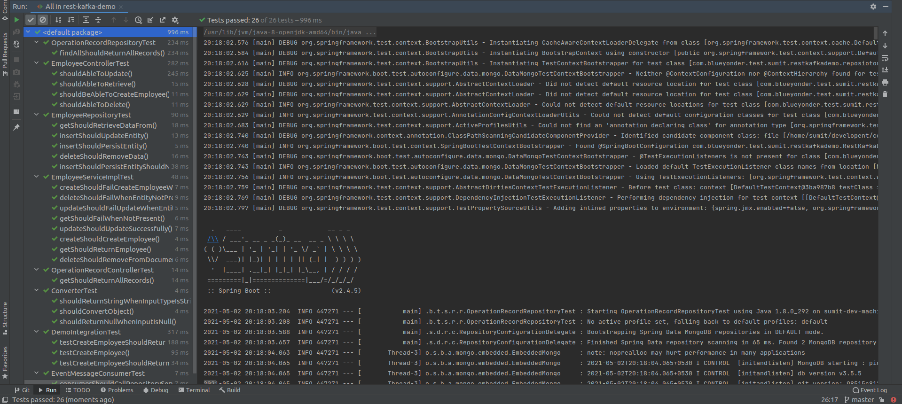
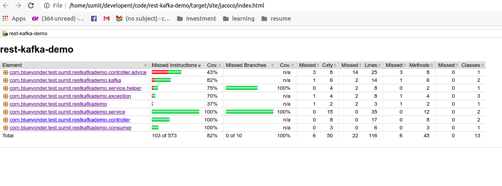

# Assignment
Following tasks needs to be performed

* Application should expose rest api and perform crud operation
* Should store the data either in in-memory on in some database
* Except Get operation all the operation data should be pushed to kafka topic

# Tasks Status
* Support of CRUD operation is done
* Using Mongo as a backend store
* Input data validation has been done
* Rest error scenario are handled
* Integration with kafka done
* Producer will publish different event (POST,PUT,DELETE)
* Consumer will consume and store in mongo as record history
* Verify records using swagger-ui done

# Pre-requisite
* Java 8
* Apache Maven
* Docker CE
* git bash

# Steps For Verification
#### 1. Clone the project
``git clone git@github.com:sumit4code/rest-kafka-demo.git``

#### 2. Create a local build
``mvn clean install -DskipTests``

#### 3. Bring up the docker images using docker composer
``docker-compose up --build --force-recreate --renew-anon-volumes``

# Verification
#### Verify application health
* Click here [Health Check up](http://localhost:9191/actuator/health)

#### Swagger-UI
* Use this link [Swagger UI](http://localhost:9191/swagger-ui/#/) to open swagger page
  

#### Unit And Integration Test cases

#### Code Coverage

## Postman Collection Exported

[link](file:./Blue Yonder.postman_collection.json)

### Reference Contact
Reach out to me sumit4job@gmail.com
